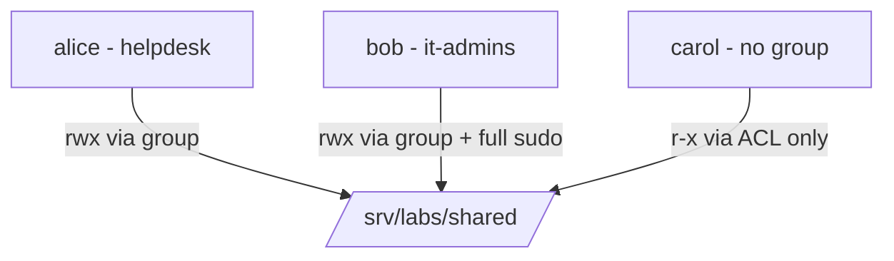

 # Lab 00 – Linux Fundamentals: Users, Groups, Permissions, sudo, ACLs

## 🎯 Objective
Build a small multi-user Ubuntu environment and control who can read, write and administer a shared
directory, using groups, permissions, sudo rules and ACLs.

## 🧰 Prerequisites
- VM: Ubuntu Server [version] on VirtualBox
- Tools: standard Linux tools + `acl` package
- Network: [NAT / host-only], SSH access [yes/no]

## 🏗️ Architecture


| User | Group | Access to `/srv/labs/shared` | sudo |
|---|---|---|---|
| alice | helpdesk | read/write | limited (status commands) |
| bob | it-admins | read/write | full |
| carol | none | read-only (ACL) | none |

## 🪜 Steps

### 1. Create groups and users
```bash
sudo groupadd helpdesk
sudo groupadd it-admins
sudo useradd -m -s /bin/bash -G helpdesk alice
sudo useradd -m -s /bin/bash -G it-admins bob
sudo useradd -m -s /bin/bash carol
sudo passwd alice   # repeat for bob and carol (lab-only passwords, never committed)
```

### 2. Create the shared directory with group permissions
```bash
sudo mkdir -p /srv/labs/shared
sudo chown root:helpdesk /srv/labs/shared
sudo chmod 2770 /srv/labs/shared   # setgid: new files inherit the group
```

### 3. Configure sudo (least privilege)
```bash
sudo visudo -f /etc/sudoers.d/it-admins
# %it-admins ALL=(ALL) ALL
sudo visudo -f /etc/sudoers.d/helpdesk
# %helpdesk ALL=(root) /usr/bin/systemctl status *
```

### 4. Grant read-only access to carol with an ACL
```bash
sudo apt install acl
sudo setfacl -m u:carol:r-x /srv/labs/shared
getfacl /srv/labs/shared
```

## ✅ Verification
```bash
id alice
ls -ld /srv/labs/shared
sudo -l -U alice
sudo -u alice touch /srv/labs/shared/test-alice   # expected: success
sudo -u carol touch /srv/labs/shared/test-carol   # expected: permission denied
```
[Paste your real outputs here]


## 💡 Lessons learned / what broke
- [What failed, e.g. a sudoers syntax error, and how you fixed it]
- [Difference you observed between group permissions and ACLs]

## 🔗 Certification link
Linux fundamentals — supports Linux badges (LabEx, Unhatched) and prepares the later IAM labs.

## 🧹 Cleanup
```bash
sudo userdel -r alice && sudo userdel -r bob && sudo userdel -r carol
sudo groupdel helpdesk && sudo groupdel it-admins
sudo rm -rf /srv/labs/shared
sudo rm /etc/sudoers.d/it-admins /etc/sudoers.d/helpdesk
```
