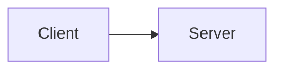

# Lab XX – [Lab Title]

## 🎯 Objective
[One sentence describing what this lab demonstrates or builds]

## 🧰 Prerequisites
- VM(s): [OS, version]
- Tools: [software, versions]
- Network setup: [if relevant]

## 🏗️ Architecture
[Diagram — draw.io export as image, or a Mermaid block, e.g.:]

## 🪜 Steps
1. [Step one — command or config]
2. [Step two]
3. [...]

## ✅ Verification
[How to prove it works — command output, screenshot, test performed]

## 💡 Lessons learned / what broke
[What failed, how you fixed it, what you'd do differently]

## 🔗 Certification link
[e.g. AZ-104, SC-300, or "none"]

## 🧹 Cleanup
[How to tear down the lab environment]
